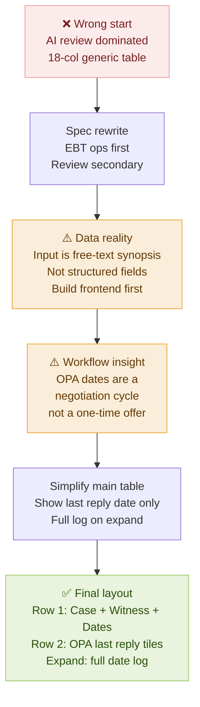
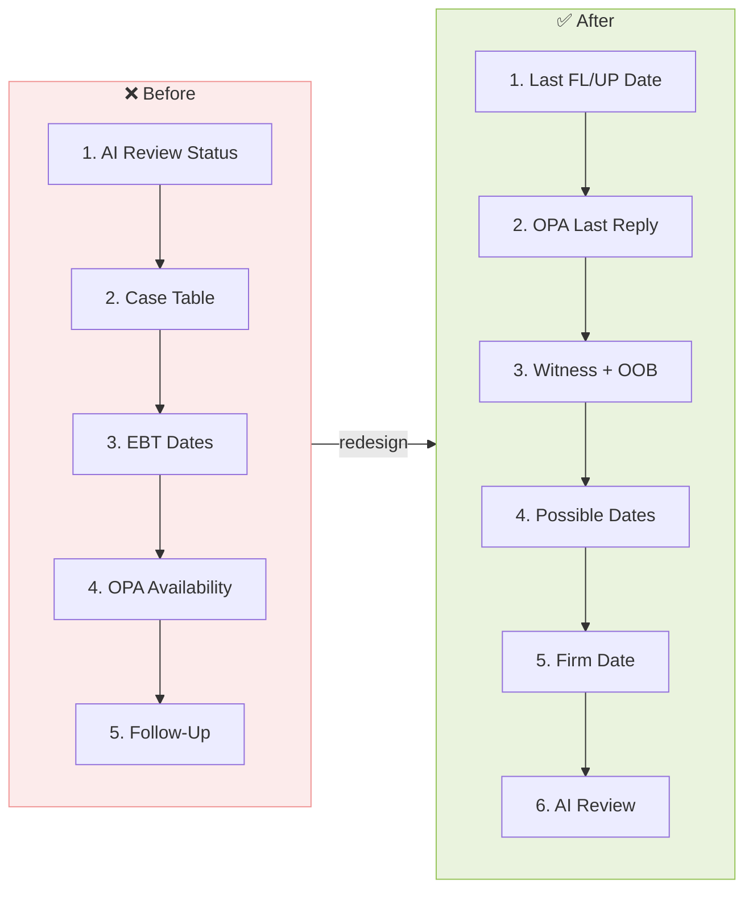
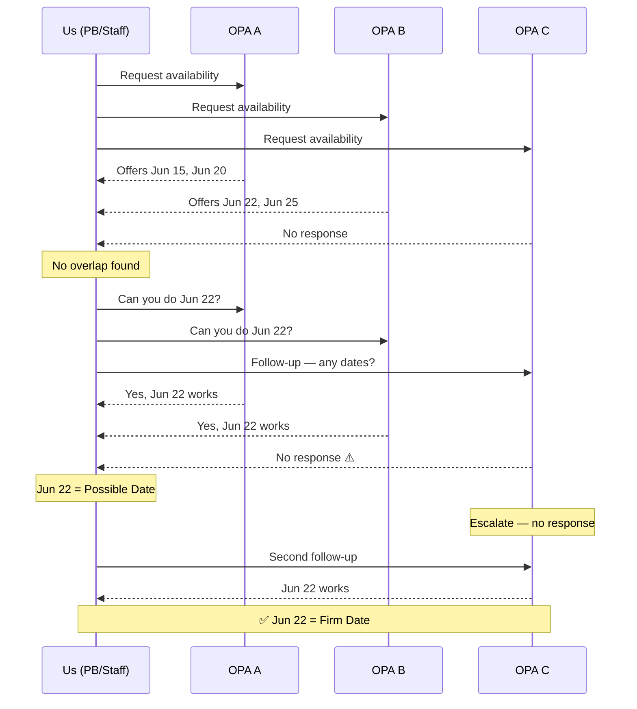
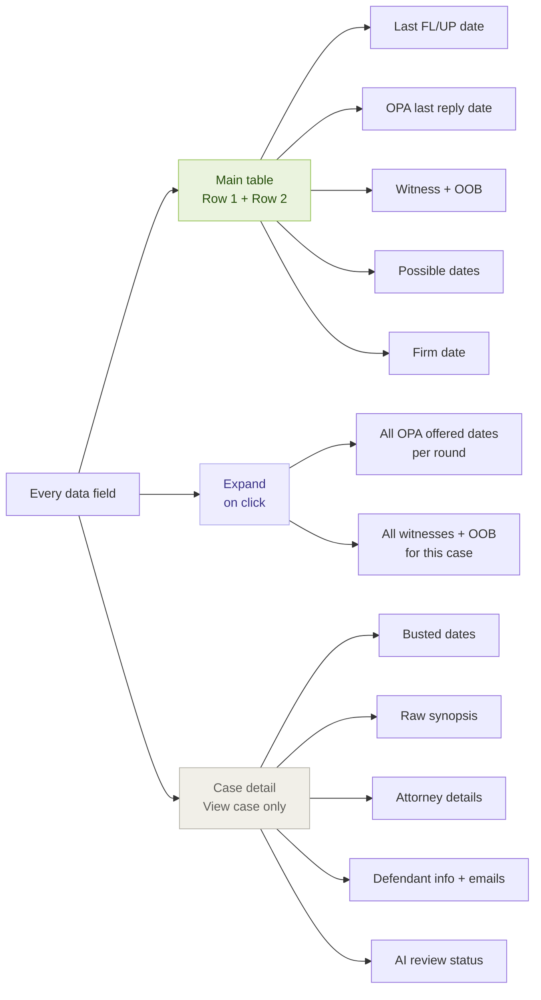
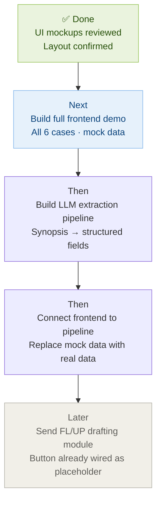

# EBT Tracker Design — Iteration Learning Log
Date: 05/13/2026

---

## Chart 1 — Iteration Flow (what changed and why)

---

## Chart 2 — UX Priority Before vs After

---

## Chart 3 — OPA Negotiation Cycle (the core workflow)

---

## Chart 4 — Table Information Hierarchy

```mermaid
flowchart TD
    ROW["Case Row"]
    ROW --> R1["Row 1 — always visible"]
    ROW --> R2["Row 2 — always visible"]
    ROW --> R3["Expanded — click to open"]

    R1 --> C1["Case name"]
    R1 --> C2["Witness + status"]
    R1 --> C3["OOB date"]
    R1 --> C4["Last FL/UP"]
    R1 --> C5["Possible dates"]
    R1 --> C6["Firm date"]
    R1 --> C7["Send FL/UP btn"]

    R2 --> D1["OPA A — last reply date"]
    R2 --> D2["OPA B — last reply date"]
    R2 --> D3["OPA C — last reply date"]
    R2 --> D4["... up to 7 OPAs"]

    R3 --> E1["All dates OPA A offered"]
    R3 --> E2["All dates OPA B offered"]
    R3 --> E3["All dates OPA C offered"]
    R3 --> E4["Oldest to newest per OPA"]

    style R1 fill:#E6F1FB,stroke:#85B7EB,color:#0C447C
    style R2 fill:#EEEDFE,stroke:#AFA9EC,color:#3C3489
    style R3 fill:#F1EFE8,stroke:#B4B2A9,color:#5F5E5A
```

---

## Chart 5 — What Belongs Where (cut decisions)

---

## Chart 6 — Build Order (what to do next)

---

## Iteration 1 — Spec Review (no build yet)

**What happened:**
ChatGPT built an initial version that over-emphasized AI review status and used a generic case table as the primary view. Reviewed the spec before touching Cursor.

**What was wrong:**
The UX priority was inverted. Human review was dominating the dashboard when it should be secondary. The whole point of the module is EBT operations, not AI validation.

**Decision:**
Rewrite spec to make EBT Dashboard the primary tab. Demote Human Review to tab 4. Main table = one row per EBT obligation.

**Lesson:**
Review the spec before building. Catching UX inversion at the spec stage costs nothing. Catching it after a full build costs hours.

---

## Iteration 2 — First Demo Built

**What happened:**
Built demo from spec. 18-column table, date badges, 6 tabs, follow-up log, date offers tab.

**What was wrong:**
- Too many columns — no way to scan at a glance
- OPA availability was column 10 of 18, completely buried
- Draft Follow-Up Email was hidden in an actions dropdown
- The "one row per EBT" structure made cases feel disconnected

**User feedback:**
Busted dates and OOB dates are not that important in the main view. What matters is last FL/UP, OPA dates, and the Send FL/UP button. Everything else belongs in case detail.

**Decision:**
Strip main table to 6 columns max. Move busted/OOB/synopsis/attorney details to expandable case detail. Keep remaining EBTs as an inline mini-table on expand.

**Lesson:**
Column count is a UX decision, not a data decision. Just because a field exists doesn't mean it belongs in the main table. Prioritize by what the user needs to decide their next action without clicking anything.

---

## Iteration 3 — Data Reality Check

**What happened:**
User shared the actual source data — free-text synopsis CSV, not structured fields.

**What this revealed:**
The entire mock data model in the spec assumed clean structured fields like `firmDate: "05/19/2026"`. Real data comes in as:
> "ebt of Dr. Alan Mercer busted 5/19/26 need new date. PB emailed opa 5/19 for new dates no resp yet."

There is a gap between the spec's data model and reality that requires an LLM extraction pipeline to bridge.

**Decision:**
Frontend-first. Build the display layer with hardcoded mock data that mirrors real data patterns. Validate the workflow table. Build the extraction pipeline separately after the UI is confirmed.

**Lesson:**
Always ask how the data actually arrives before designing the data model. The display layer and the ingestion layer are separate problems. Build them in the right order.

---

## Iteration 4 — Multi-OPA Problem

**What happened:**
Realized there can be up to 7 defense counsel (OPAs) per case, each with 2–7 offered dates. The original design only modeled one OPA column.

**What was wrong:**
Single OPA column assumed one party negotiating. Reality is simultaneous multi-party scheduling where each OPA is independent.

**Decision:**
Dynamic OPA columns — one column per OPA. Each shows latest offered dates. Expand row shows each OPA's full history side by side.

**Lesson:**
Domain knowledge changes the data model. "How many parties are involved" is a question that should be asked before designing columns.

---

## Iteration 5 — Negotiation Cycle Insight

**What happened:**
User corrected the mental model of what OPA date logs represent. This is not a simple availability offer — it's a multi-round negotiation cycle:

1. Email all OPAs → they send available dates
2. Find overlap candidates
3. Email OPAs with no overlap → "are you free on X?"
4. They say yes/no or send new dates
5. Repeat until all OPAs converge
6. That convergence = Firm Date

Each round of replies creates a new log entry per OPA.

**What changed:**
- "Possible Dates" = dates confirmed by 2+ OPAs, labeled with who's still pending
- "Firm Date" = only set when all OPAs confirm the same date
- Log entries show what was asked and what was replied, not just what dates exist

**Lesson:**
Don't design a log structure until you understand the workflow that generates the log. The log shape follows the process, not the other way around.

---

## Iteration 6 — Main Table Simplification

**What happened:**
After seeing the multi-OPA columns mockup with all dates visible in the main row, user simplified the requirement: main table just shows when each OPA last replied. Full date history goes in the expand.

**Why this is better:**
The main table is for scanning. "Did OPA D respond yet?" is a yes/no question answerable by a single date badge. All the offered dates are only relevant when you're actively negotiating, which requires the full log anyway.

**Decision:**
OPA tile in main row = last reply date + responded/no response indicator. Expand = every batch of dates they've offered, oldest to newest, with context note.

**Lesson:**
The main table should answer "what's the status?" The expanded view answers "what happened?" These are different questions and need different information density.

---

## Iteration 7 — Layout Corrections (Final)

**What happened:**
User identified two remaining layout issues:
1. Witness and case name were on the same line — hard to scan
2. OOB date is tied to a specific witness, not the case — clicking it should show all witnesses and their OOB dates

**Changes made:**
- Case name gets its own row section (top), Witness gets its own cell (separate column)
- Clicking Witness cell OR OOB date opens a dropdown listing all witnesses for that case with their individual OOB dates and status
- Row 2 labeled "Last reply:" at the front so it's immediately clear what that row is
- 2-row-per-case layout: Row 1 = case/witness/dates/actions, Row 2 = OPA last reply tiles

**Lesson:**
OOB is a witness-level property, not a case-level property. Attaching it visually to the case obscures which witness is at risk. The data model and the visual hierarchy need to match the actual domain structure.

---

## Summary — What This Module Actually Is

After 7 iterations, the core design is:

**Main table (2 rows per case):**
- Row 1: Case → Witness (clickable, shows all witnesses + OOB) → OOB → Last FL/UP → Possible Dates → Firm Date → Actions
- Row 2: "Last reply:" label → OPA tiles (one per counsel, shows last reply date + responded/not)

**Expand:**
- Full date log per OPA: every batch of dates offered, oldest to newest, with negotiation context

**What got cut from main table:**
Busted dates, OOB details, synopsis, attorney info, defendant emails, all belong in case detail view only.

**Core principle that emerged:**
The main table has one job: tell you whether you need to act and on what. Everything else is detail that belongs one click away.
