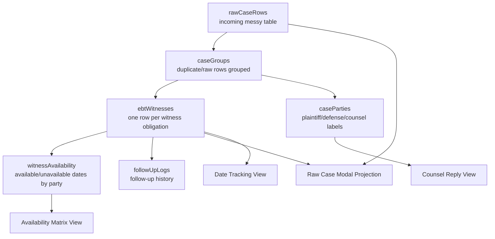

```mermaid
flowchart TD
  A[rawCaseRows<br/>incoming messy table] --> B[caseGroups<br/>duplicate/raw rows grouped]
  B --> C[ebtWitnesses<br/>one row per witness obligation]
  B --> D[caseParties<br/>plaintiff/defense/counsel labels]
  C --> E[witnessAvailability<br/>available/unavailable dates by party]
  C --> F[followUpLogs<br/>follow-up history]
  A --> G[Raw Case Modal Projection]
  C --> G
  E --> H[Availability Matrix View]
  D --> I[Counsel Reply View]
  C --> J[Date Tracking View]
```
